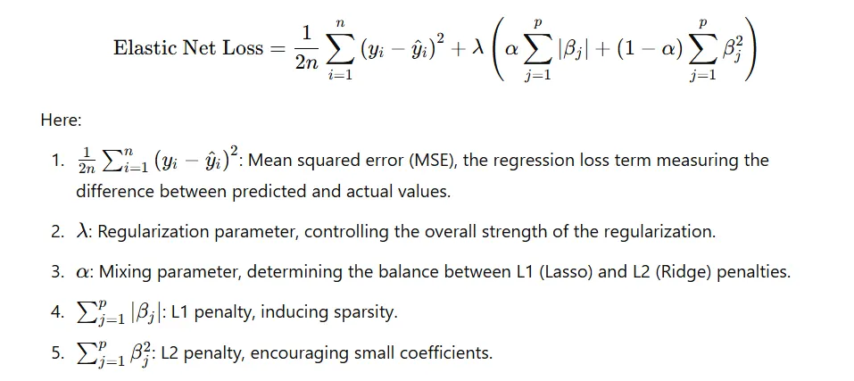

### Why we have Elastic Net Regression ?
Handling multicollinearity with feature selection and stable outputs.
Lasso problems:
- Unstable when predictors are highly correlated
- Arbitrarily picks one feature and drops the rest

Ridge problems:
- No sparsity
- Keeps all features, even weak ones

Elastic Net fixes both.

---

## Elastic Net



Think in two forces acting on each coefficient:
L2 part (ridge) -> Smooth shrinkage, Keeps correlated features together, Prevents instability

L1 part (lasso)
- Creates a kink at zero
- Pushes weak features to exact zero
- Produces sparsity

Elastic Net balances both forces.
---
What happens with correlated features
Ridge effect: spreads weight across correlated variables
Lasso effect: removes weak variables

Net result:
Groups of correlated features enter or leave the model together.
This is called the grouping effect.

**Bias–variance behavior**
As λ increases: Bias ↑ Variance ↓

As α increases (toward lasso):
- More sparsity
- Less stability

As α decreases (toward ridge):
- Less sparsity
- More stability


### When to use Elastic Net ?
- Features are correlated
- You want sparsity, but lasso is unstable
- p≫n
- You want a safer default than pure lasso

```python
import numpy as np
from sklearn.linear_model import ElasticNet
from sklearn.model_selection import train_test_split
from sklearn.preprocessing import StandardScaler

# sample data
X = np.random.randn(100, 10)
y = X[:, 0] * 3 + X[:, 1] * -2 + np.random.randn(100) * 0.5

# train-test split
X_train, X_test, y_train, y_test = train_test_split(X, y, test_size=0.2)

# elastic net is scale-sensitive
scaler = StandardScaler()
X_train = scaler.fit_transform(X_train)
X_test = scaler.transform(X_test)

# elastic net model
model = ElasticNet(
    alpha=0.1,      # λ (overall regularization strength)
    l1_ratio=0.7    # α (0 = ridge, 1 = lasso)
)

model.fit(X_train, y_train)

# coefficients
print(model.coef_)
print("Intercept:", model.intercept_)

# score
print("R² score:", model.score(X_test, y_test))
```


- Some coefficients are exactly zero (lasso effect)
- Correlated features are not randomly dropped (ridge effect)
- Increasing alpha → more bias, less variance
- Increasing l1_ratio → more sparsity
